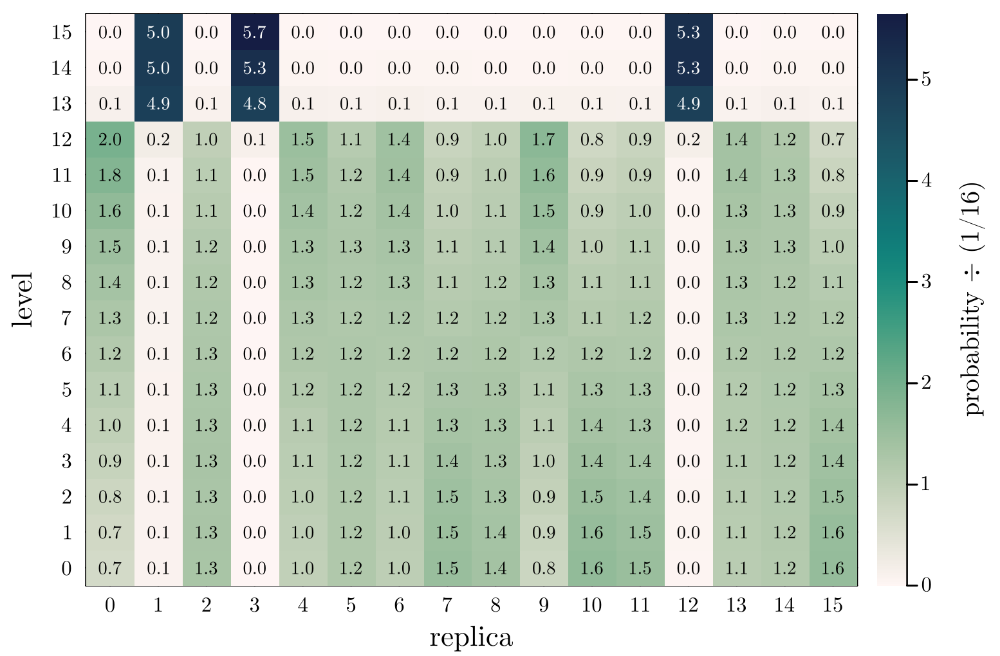

# Replica exchange analysis

The `remd_data` function reads the output of a Gromacs-generated 
replica-exchange simulation file, and provides some tools for visualization
of the quality of the exchange process.

!!! compat
    This function was introduced in `MolSimToolkit` version 1.1.0. 

    The function was tested to read log files produced by Gromacs versions: 
      - 2019.4
      - 5.0.4
    Compatibility with other versions is not guaranteed (issue reporting and contributions are welcome). 

    The `heatmap` and the support for the `stride` argument in `remd_replica_path` where introduced in version 1.6.0

## Reading REMD data

First, read the data from the Gromacs simulation log file:

```julia-repl
julia> using MolSimToolkit

julia> data = remd_data(MolSimToolkit.remd_production_log)
```
where `MolSimToolkit.hremd_production_log` is an example `log` file produced by Gromacs.

This will result in a data structure with three fields:

- `steps`: Vector of steps at which the exchange was performed.
- `exchange_matrix`: Matrix of exchanges performed. 
  Each row corresponds to a step and each column to a replica. 
- `probability_matrix`: Matrix of probabilities of finding each replica at level of 
  perturbation. Each column corresponds to a replica and each row to a level of
  perturbation.

## Probability heatmap

One way to visualize the exchange it to produce a heatmap of expected probabilities. This
can be done with the auxiliary `heatmap` function that is provided for the output
of `remd_data`: 

```julia
using MolSimToolkit
using Plots
data = remd_data("./gromacs_log.dat")
heatmap(data)
```

Which will produce a plot of the following form:



The number of replicas here is 10 (0-9), thus the expected ideal probability of finding each replica
in each level is $1/10$. The probabilities are divided by $1/10$, such that $1.0$ implies 
an optimal exchange at that replica and level. 

The example displays a reasonably good replica exchange pattern. However,
replica 2 sampled level 0 about 30% more than expected, and replica 8 sampled 
level 0 about 30% less than expected, as indicated by the 1.3 and 0.7 annotations. 

To produce a similar heatmap, but with the absolute (not normalized) probabilities of 
observing each replica at each level, use `heatmap(data; probability_type=:absolute)`. 

!!! compat
    The `probability_type` option of `heatmap` was introduced in version 1.7.0.

## Replica path

A heatmap as the one above suggests checking the path of the replicas along the exchange. 
This can be obtained with the `remd_replica_path` function. For example, to obtain the path
of the replicas of number 0 and 1. Replica 0 appeares to have visited reasonably well 
all levels from 0 to 12, and replica 1 appears to be trapped in leves 13 to 15.

```julia
# Obtain the paths
path0 = remd_replica_path(data, 0; stride = 500)
path1 = remd_replica_path(data, 1; stride = 500)

# Plot the path
default(fontfamily="Computer Modern")
plot(
  [path0  path1],
  xlabel="step",
  ylabel="replica level",
  label=[ "Replica 0" "Replica 1" ],
  framestyle=:box
)
```

Producing the following plot:


The plot confirms that the replica starting at position 0 sampled properly all states from 0 to 12,
while the replica starting at position 1 was trapped in the high energy states.

## Probability data

An alternative visualization of the exchange process is
given by the probability matrix:

```julia-repl
julia> scatter(
           data.probability_matrix,
           labels= Ref("Replica ") .* string.((0:9)'),
           framestyle=:box,
           linewidth=2,
           ylims=(0,0.12), xlims=(0.7, 10.3),
           xlabel="Level", xticks=(1:10, 0:9),
           ylabel="Probability",
           alpha=0.5,
           margin=0.5Plots.Measures.cm,
       )
```

Which produces:


Ideally, the probability of each replica populaing each level should be the inverse of the number of replicas (here $1/10$). In this case, the simulation does not provide a proper sampling
of exchanges, becuse it is a short extract of a longer simulation. 

## Reference functions

```@autodocs
Modules = [MolSimToolkit]
Pages = ["gromacs/remd.jl"]
Order = [:function, :type]
```


