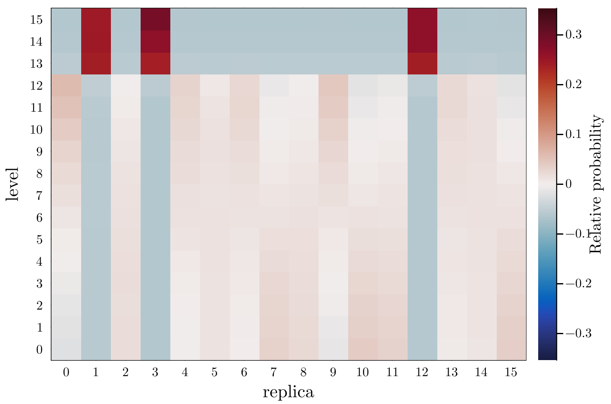

# Replica exchange analysis

The `remd_data` function reads the output of a Gromacs-generated 
replica-exchange simulation file, and provides some tools for visualization
of the quality of the exchange process.

!!! compat
    This function was introduced in `MolSimToolkit` version 1.1.0. 
    The function was tested to read log files produced by Gromacs versions: 
      - 2019.4
      - 5.0.4
    Compatibility with other versions is not guaranteed (issue reporting and contributions are welcome). 

## Reading REMD data

First, read the data from the Gromacs simulation log file:

```julia-repl
julia> using MolSimToolkit

julia> data = remd_data(MolSimToolkit.remd_production_log)
```
where `MolSimToolkit.hremd_production_log` is an example `log` file produced by Gromacs.

This will result in a data structure with three fields:

- `steps`: Vector of steps at which the exchange was performed.
- `exchange_matrix`: Matrix of exchanges performed. 
  Each row corresponds to a step and each column to a replica. 
- `probability_matrix`: Matrix of probabilities of finding each replica at level of 
  perturbation. Each column corresponds to a replica and each row to a level of
  perturbation.

## Probability heatmap

One way to visualize the exchange it to produce a heatmap of expected probabilities. This
can be done, for example, with:

```julia
using Plots
using MolSimToolkit

data = remd_data("./gromacs_log.dat")

nreplicas = size(data.probability_matrix,1) # number of replicas
maxprob = maximum(data.probability_matrix) # maximum observed probability - for setting color limits

default(fontfamily="Computer Modern")
heatmap(
    transpose(data.probability_matrix .- (1/nreplicas)),
    xlabel="replica", ylabel="level", 
    clims=(-maxprob, maxprob), 
    color=cgrad(:balance), 
    xticks=(1:nreplicas, 0:nreplicas-1), 
    yticks=(1:nreplicas, 0:nreplicas-1), 
    framestyle=:box, 
    colorbar_title="Relative probability", 
)
```

Which will produce a plot of the following form:



The plot was built such that the zero of the color scale is the expected probability in a 
perfect sampling, for that number of replicas (in this case, $1/16$). 

Here, we see that replicas 1, 3, and 12 got trapped in levels 13, 14, 15, and display roughly
30% probability of being at the top temperatures. Thus, these replicas didn't exchange well
with the rest of the replica system. The other replicas show colors that are close to zero,
which mean a proper interchange of replicas among the levels from 0 to 12. 

## Replica path

!!! compat 
    The `remd_replica_path` function was introduced in version 1.5.0.


A heatmap as the one above suggests checking the path of the replicas along the exchange. 
This can be obtained with the `remd_replica_path` function. For example, to obtain the path
of the replica of number 1, which appears to be trapped in the top temperatures, do:

```julia
# Obtain the path
path = remd_replica_path(data, 1)

# Plot the path
default(fontfamily="Computer Modern")
plot(
  data.steps,
  path, 
  xlabel="step",
  ylabel="replica level",
  label="Replica 1",
  framestyle=:box
)
```

Producing the following plot:


The plot confirms that the replica starting at position 1 was trapped in the higher energy states. 

## Probability data

An alternative visualization of the exchange process is
given by the probability matrix:

```julia-repl
julia> scatter(
           data.probability_matrix,
           labels= Ref("Replica ") .* string.((0:9)'),
           framestyle=:box,
           linewidth=2,
           ylims=(0,0.12), xlims=(0.7, 10.3),
           xlabel="Level", xticks=(1:10, 0:9),
           ylabel="Probability",
           alpha=0.5,
           margin=0.5Plots.Measures.cm,
       )
```

Which produces:


Ideally, the probability of each replica populaing each level should be the inverse of the number of replicas (here $1/10$). In this case, the simulation does not provide a proper sampling
of exchanges, becuse it is a short extract of a longer simulation. 

## Reference functions

```@autodocs
Modules = [MolSimToolkit]
Pages = ["gromacs/remd.jl"]
Order = [:function, :type]
```


