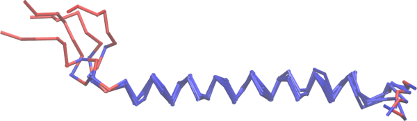

```@meta
CollapsedDocStrings = true
```

# Structural alignment

MolSimToolkit.jl provides tools to perform rigid-body structural alignment throughout 
trajectories.

Two types of alignments are available: the "standard" rigid-body alignment, frequently
used to compute RMSDs and RMSFs in MD trajectories, and a **robust** structural alignment
method, `mdlovofit`. The robust alignment method provides better alignments of the
rigid (or core) fractions of the structures, while magnifying the variability of the
flexible regions.

## Conventional rigid-body alignment

To compute the RMSD or matrix of RMSDs throughout a trajectory, use:

```@docs
rmsd(::Simulation, ::AbstractVector{<:Integer})
rmsd_matrix
```

The `rmsd` routine has the option to compute the `rmsd` of a set of atoms, while aligning another subset. For example, here we compute the RMSD of all atoms of a loop, while aligning the full protein CA backbone:

```@example rmsd_of
using MolSimToolkit
using Plots
sim = Simulation(
    MolSimToolkit.Testing.namd2_pdb, # pdb file
    MolSimToolkit.Testing.namd2_traj, # trajectory file
)
r = rmsd(sim, "protein and name CA"; rmsd_of="protein and residue 47 to 53")
plot(MolSimStyle, r, xlabel="frame", ylabel="rmsd of 47 to 53")
```

The aligned and `rmsd_of` groups may or may not overlap. For example, `rmsd_of` can be a ligand, or another protein structure. 

!!! note 
    The `rmsd` routine use periodic boundary conditions, but they **reconstruct** the structures to guarantee that the molecules are not broken because of the periodic boundaries during alignment. 
    This reconstruction assumes that atoms that are close in the sequence of the file are also close 
    to each other in space. This must be true, independently, for the aligned and `rmsd_of` selections.
    The `rmsd_of` selection is reconstructed close to the aligned selection, by identifying the shortest distance between both sets. 

Other routines that allow advanced and fine-tuned structural alignment analyses or implementations, are:

```@docs
MolSimToolkitShared.rmsd(::AbstractVector{<:AbstractVector}, ::AbstractVector{<:AbstractVector})
MolSimToolkitShared.center_of_mass
MolSimToolkitShared.align
MolSimToolkitShared.align!
MolSimToolkitShared.alignment_movements
MolSimToolkitShared.apply_alignment_transformation!
```

## Robust rigid-body alignment

MDLovoFit is a package for the analysis of the mobility and structural fluctuation in Molecular Dynamics simulations. It allows the automatic identification of rigid and mobile regions of protein structures.

For example, it is possible to automatically identify a stable region of a protein in simulation in which the protein displays high structural flexibility, as illustrated in the example. The regions of low mobility are automatically detected by the method.

The software provides, as output, the Root-Mean-Square Deviations of the conserved structures, and of the divergent structures. A trajectory PDB file is output for the visualization of the results. 

The execution of the MDLovoFit procedure typically has three steps:

- [Step1:](@ref mdlovofit1) Identify the length of the structure that can be aligned with a precision lower than a threshold. This is done with the `map_fractions` function.
- [Step 2:](@ref mdlovofit2) Align the trajectory for the fraction of atoms desired, with the `mdlovofit` function.
- [Step 3:](@ref mdlovofit3) Visualize the aligned trajectory and aligned atoms.

!!! note
    Please cite the following references if these functions were useful:

    L. Martínez, **Automatic identification of mobile and rigid substructures in molecular dynamics simulations and fractional structural fluctuation analysis.** PLoS One 10(3): e0119264, 2015.  
    [Full text](http://journals.plos.org/plosone/article?id=10.1371/journal.pone.0119264).

    L. Martínez. R. Andreani, J. M. Martínez. **Convergent Algorithms for Protein Structural Alignment.** BMC Bioinformatics, 8, 306, 2007.
    [Full text](https://bmcbioinformatics.biomedcentral.com/articles/10.1186/1471-2105-8-306).

    It is possible to use `mdlovofit` as a standalone program by downloading it [here](https://m3g.github.io/mdlovofit/).

### [Step 1: Map fractions of aligned atoms and overlap precision](@id mdlovofit1)

```@docs
map_fractions
MapFractionsResult
plot(::MapFractionsResult)
```

The `map_fractions` function scans the trajectory and tries to align the C$$\alpha$$ atoms of the protein
structures, but considering only a fraction of the atoms for the alignment. The alignment is performed
such that only the fraction of atoms of smaller displacements interfere with the overlap. Three RMSDs are
then obtained: the RMSD of the best aligned atoms, the RMSD of the remaining (highly mobile) atoms, and
the RMSD of all atoms. For example:

```@example mdlovofit
using MolSimToolkit, MolSimToolkit.Testing

# Create Simulation object from pdb and trajectory file names
sim = Simulation(Testing.namd_pdb, Testing.namd_traj)

# Run map_fractions
mf = map_fractions(sim)
```

In the above run, we can readily see that 79% of the atoms of the structure can be aligned
with RMSD smaller than 1.0Å. The RMSDs of the low and high mobility, and 
all-C$$\alpha$$ RMSDs are available as the fields of the `mf` object generated. 

A convenience recipe can plot the results:

```@example mdlovofit
using Plots
plot(mf)
```

Where we see that about 80% of atoms can be aligned to less than 1.0Å RMSD, while
at the same time the 20% more flexible atoms will display an RMSD of about 7Å.

We will now consider that, in this case, 1.0Å is a good threshold for defining the 
conserved structural core of the protein, and proceed with the next analysis, where
we will ask `mdlovofit` to obtain the best alignment of 80% of the atoms, of each
frame relative to the first frame.

### [Step 2: Align the trajectory for a given fraction of atoms](@id mdlovofit2)

```@docs
mdlovofit
MDLovoFitResult
plot(::MDLovoFitResult)
```

Continuing with the above example, now we will call the `mdlovofit` function, to obtain
the best alignment of 80% of the atoms in each frame relative to the first frame:

```@example mdlovofit
md = mdlovofit(sim; fraction=0.8, output_name="mysim")
```

We now see that we can, in average, align 80% of the atoms in all frames to 1.13Å. 
The output RMSD and RMSF data is available in the `md` data structure, and additionally
three files were generated, containing:

1. `mysim_aligned.pdb`: a sequence of PDB files of the aligned trajectory.
2. `mysim_rmsd.dat`: the RMSD data for low, high, and all atoms.
3. `mysim_rmsf.dat`: the RMSF data for the atoms, resulting from the robust alignment.

We can plot an overview of the results with:

```@example mdlovofit
plot(md)
```

And we can see that, in this short (5-frame) trajectory, the N-terminal region of the 
protein is the one responsible for the structural deviations, while there is a 
rigid structural core between residues I221 and K249.

### [Step 3: Visualization of the aligned trajectory](@id mdlovofit3)

The PDB file created by `mdlovofit` contains the frames aligned to the reference frame,
according to the robust alignment based on the least mobile substructure (determined
by `fraction`). The file contains multiple models, separated by the `END` keyword.

The `occupancy` field of the atoms determines if the atom was used in the alignment,
thus if it was found among the least mobile atoms of the simulation. The `beta` field
contains the RMSF of the atom, in each frame. 

Using, for example, [VMD](https://www.ks.uiuc.edu/Research/vmd/), it is possible to
display all frames at once, colored by `occupancy`, providing an
overview of the mobility of the structure:



This structural superposition and the associated colors are correlated with the 
RMSF plot above. Red atoms were not used for the alignment and display high
mobility, and blue atoms represent the stable core of the structure and
were aligned.


